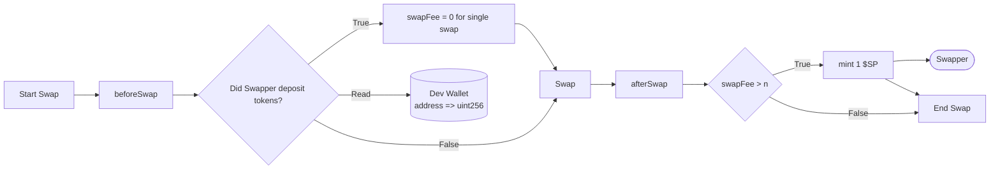

# Swoupon: Liquidity Rewards System

Swoupon is a uniswap v4 hook swapping rewards mechanism. It allows swapper to accumulate Swoupon tokens through swaps, which can later be redeemed for fee discounts.

## Overview

The Swoupon system consists of two main components:

1. **Swoupon Contract**: A Uniswap V4 hook that overrides fees and mints reward tokens to users.
2. **Swoupon Tokenomics** TBD

## How It Works

- **Earning Swoupon Tokens**: Users earn 1 SwoopPon token for each swap they perform.
- **Fee Discounts**: Users who have accumulated more than 5 tokens get the opportunity to spend those tokens to reduced there swapping fees zero.
- **Token Management**: Users can deposit tokens into the hook contract.

## Key Features

- **Dynamic Fee Adjustment**: The system can dynamically adjust fees based on user balances.
- **Reward Mechanism**: Rewards users with tokens for participating in swaps.
- **Price Oracle Integration**: TBD

## Contract Structure

- `SwoopPon.sol`: Main contract that implements the Uniswap V4 hook interface, handles token rewards and deposits.

### Hook Logic Overview

---

### Conditional Logic

This hook uses conditional logic to determine fee behavior:

- If the swapper **has deposited** tokens beforehand:
  - The swap is **free** (`swapFee = 0`)
- If not:
  - The fee is retained
  - A **Dev Wallet** is credited

After the swap, the hook evaluates:

> Was the **swap fee greater than `n`**?

If so, a reward token (`$SP`) is minted.

---

## ⚙️ Hook Flags

This hook uses the following Uniswap V4 lifecycle flags:

- `beforeSwap`
- `afterSwap`

---

